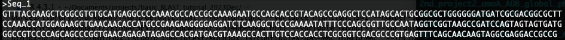
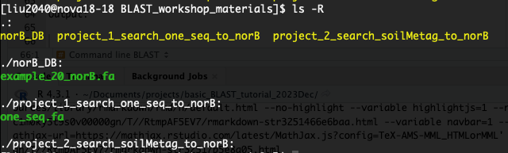
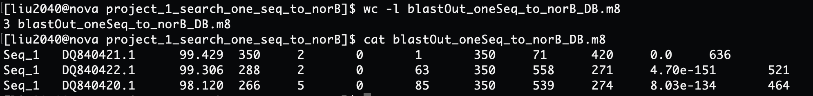
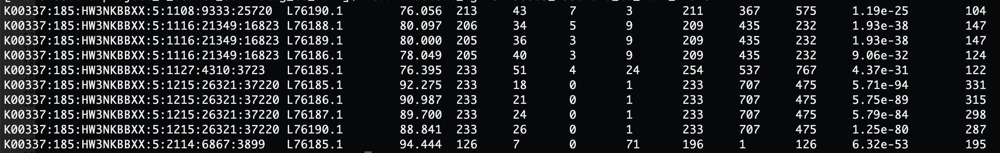

---- 

Author: Jia Liu    

Date: 12/10/2023

----

<br>


# Overview

<br>

## Run BLAST on NCBI website


<br>

Suppose after days of hard working, you generated a nucleotide sequence that might of interest:

{width=100%}


You would like to know what gene it is, which organism it is from… You can easily get all these information through a BLAST on the [NCBI BLAST website](https://blast.ncbi.nlm.nih.gov/Blast.cgi). Let’s copy and paste this gene, and try the online BLAST.

It takes a little while to BLAST one gene against NCBI `nt` database. `nt` is a big nucleotide collection consists of annotated nucleotide sequences from multiple sources. But maybe you are interested in searching a big amount of gene sequences from a specific local database that you defined. It may be trivial to do this search on the BLAST web browser then. That’s when the command line BLAST may become more helpful. And today we will go through this process together.

<br>

## Command line BLAST

<br>

Today we will mainly focuing on how to perform BLAST through command line. Let's copy the material for this workshop to our home directory:

```bash
cp -r /work/adina/liu2040/BLAST_workshop_materials/ ~

cd ~/BLAST_workshop_materials

ls -R
```


Output:

{width=100%}


I collected 20 genes that are related to Nitric Oxide Reductase (norB), and I plan to make a local database with these 20 genes. These genes are in the file `/home/liu2040/BLAST_workshop_materials/norB_DB/example_20_norB.fa`.

<br>

After building the local norB database with the 20 norB genes, we will go though BLAST by doing two projects today:

- Project 1. Understand BLAST with small datasets

I obtained one nucleotide sequence from my experiments, I want to see if the sequence is related with the norB genes in my local norB database. So the task is to align `/home/liu2040/BLAST_workshop_materials/project_1_search_one_seq_to_norB/one_seq.fa` to the norB database we built. 

- Project 2. Apply BLAST on real datasets

I have one agricultural soil metagenome file (`/work/adina/soil_metagenomes/mgrast_258_agricultural_soil_metag_299.1/mgm4811960.3_299.1.fa`), and I want to check if any sequences within this metagenome is associated with the norB genes in my local database. So the task this time is to align the metagenome against the local norB database.

<br>

# Project 1. Understand BLAST with small datasets

<br>

## Make a local BLAST database with `makeblastdb`

<br>

Let's first go to the folder with the file of 20 norB gene sequences and have a look at the gene IDs:

```bash
cd norB_DB/

grep '^>' example_20_norB.fa
```

We will now make a local database for these 20 norB genes:

```bash
makeblastdb -in example_20_norB.fa -dbtype nucl -out example_20_norB.fa

ls
```

<br>

## BLAST sequences against the local database

<br>

Navigate to project 1 directory by:

```bash
#cd /home/liu2040/BLAST_workshop_materials/project_1_search_one_seq_to_norB

# Or
cd ../project_1_search_one_seq_to_norB

ls

cat one_seq.fa
```


This one sequence is the query sequence that we are going to align against the local norB database. I would suggest something like the following variables, note that the -outfmt 6 flag identifies a tabular output:

```bash
# Usage: blastn -query <seq / metag file> -db <db file> -out <name of output> -outfmt 6

blastn -query one_seq.fa -db ../norB_DB/example_20_norB.fa -out blastOut_oneSeq_to_norB_DB.m8 -outfmt 6
```


Let's get some basic information about the blast output file `blastOut_oneSeq_to_norB_DB.m8`:


{width=100%}


The column headers of our BLAST output are as below:  

`qseqid sseqid pident length mismatch gapopen qstart qend sstart send evalue bitscore`


You can find more information about `-outfmt 6` format from this [webpage](https://sites.google.com/site/wiki4metagenomics/tools/blast/blastn-output-format-6).


Alright, you just did your first BLAST through command line, congratulations! 

<br>

# Project 2. Apply BLAST on real datasets

<br>

Now it's time to work on some real-world data! Let's first navigate to the project 2 directory:

```bash
cd ../project_2_search_soilMetag_to_norB/

ls
```

This directory is empty. Our goal at this step is to search an agricultural soil metagenome against the norB database we created in project 1 based on the 20 norB genes I collected. The soil metagenome is stored at `/work/adina/soil_metagenomes/mgrast_258_agricultural_soil_metag_299.1/mgm4811960.3_299.1.fa`. We can get the total number of sequences within this file by:

```bash
grep '^>' /work/adina/soil_metagenomes/mgrast_258_agricultural_soil_metag_299.1/mgm4811960.3_299.1.fa | wc -l
```

Output: 2865807

That sounds like a large number of sequences, which is quite common to expect for soil metagenomes! And now these sequences in the metagenome file will be our query sequences, and will be searched against the norB gene database we created earlier.

<br>

## Make a local BLAST database with `makeblastdb`

<br>

In this section, we will use the local database we made with the 20 norB genes earlier:

```bash
ls ../norB_DB/
```

<br>

## BLAST sequences against the local database

<br>

Let's now blast the agricultural soil metagenome `/work/adina/soil_metagenomes/mgrast_258_agricultural_soil_metag_299.1/mgm4811960.3_299.1.fa` against the norB database:

```bash
# Usage: blastn -query <seq / metag file> -db <db file> -out <name of output> -outfmt 6

blastn -query /work/adina/soil_metagenomes/mgrast_258_agricultural_soil_metag_299.1/mgm4811960.3_299.1.fa -db ../norB_DB/example_20_norB.fa -out blastOut_mgm4811960.3_299.1.fa_to_norB_DB.m8 -outfmt 6
```

This step may take several minutes, but imagine we need to search each of the 2865807 sequences from the soil metagenome file against our local norB database which contains 20 norB genes ...


After the BLAST process is finished, you should see the output file `blastOut_mgm4811960.3_299.1.fa_to_norB_DB.m8`. If the file is empty, it means that none of the sequences from the soil metagenomes were aligned with any of the norB genes in our database. If not, some sequences from the metagenome file were somewhat similar with some norB genes in our database!

<br>

# Process BLAST output

<br>

## Basic explore

<br>

You can always see how the BLAST output looks like, or how many lines of results it generated by:

```bash
wc -l blastOut_mgm4811960.3_299.1.fa_to_norB_DB.m8
```

Output: 20


```bash
head blastOut_mgm4811960.3_299.1.fa_to_norB_DB.m8
```


Output: 

{width=100%}


Again, the column headers for BLAST output with `-outfmt 6` format are as below:  

`qseqid sseqid pident length mismatch gapopen qstart qend sstart send evalue bitscore`


The raw output directly resulted from BLAST analysis often needs to be further processed before you can really use them for further analysis or draw conclusions. Why? You may see some problems from the raw output:

- Although some query sequences aligned to some genes from the database, their mapping / aligning parameters are low and may not reach your expectation. E.g., The percentage of identity (column 3) between the two sequences is just $76.056\%$, but you want them to be at least $90\%$ similar with each other.

- The same query sequence (`qseqid` in column 1) may hit multiple different sequences from the database being used (`sseqid` in column 2). This is because that query sequence may have some levels of similarity with not just one, but multiple sequences from the database. In some situations, you may want all the database genes that have a certain level of similarity with you query sequence. But under some other scenarios, you may only be interetsed in the database gene that most alike with your query sequence. 


**So, some filtering and processing may need to be performed on the raw BLAST output!**

<br>

## Some directions for processing the raw BLAST output

<br>

In this section, the codes are not the most important as they may change quite a lot based on different situations in different projects. But I want to point you to some directions to think about when you have some raw BLAST output.

<br>

### Filtering based on some columns of interest

<br>

Like we discussed above, for a raw BLAST output, you may want to keep the hits or rows with some specific thresholds on specific columns. For example, if I want the hits with evalue (column 11) < 0.00001 and percentage of identity (column 3) >= a threshold of 90:

```bash
awk '{ if ($3 >= 90 && $11 < 0.00001) {print} }' blastOut_mgm4811960.3_299.1.fa_to_norB_DB.m8 > eval5floats_pident90_filtered_blastOut_mgm4811960.3_299.1.fa_to_norB_DB.m8
```

<br>

### Get the best hit(s)

<br>

In our case of BLASTing metagenome sequences against the 20 norB genes, for each query sequence (metagenome; column 1), I want to know the "best" norB gene (column 2) that it is most similar with although it may be similar to multiple norB genes. So what I will do is:

- first get and save all the unique query sequences in an array

```bash
mapfile -t my_array < <(cut -f 1 eval5floats_pident90_filtered_blastOut_mgm4811960.3_299.1.fa_to_norB_DB.m8 | sort | uniq);
```

- for each query sequence saved in the above array, only find the norB gene that it is mostly alike

Note: In the case of one query sequence (column 1) aligned to multiple database sequences (column 2), BLAST will by default rank the hits or rows from the best aligned to the worst one based on the `evalue` column. So, the top database gene will be the best hit for a query sequence if more than one database gene exist.


```bash
for i in "${my_array[@]}";
do
	new_i=$(echo $i | sed 's/\[/\\[/g' | sed 's/\]/\\]/g');
	grep -m 1 "$new_i" eval5floats_pident90_filtered_blastOut_mgm4811960.3_299.1.fa_to_norB_DB.m8 >> bestHits_eval5floats_pident90_filtered_blastOut_mgm4811960.3_299.1.fa_to_norB_DB.m8;
done

# the `new_i` variable is necessary to generate, since some query name may contains "[" or "]", and `grep` cannot find such patterns
```

<br>

### Summary

Hopefully now you have some ideas about how to process the BLAST output. Keep in mind that for different projects, the columns and thresholds to be used for filtering or the best hit(s) you want may be very different!


<br>


